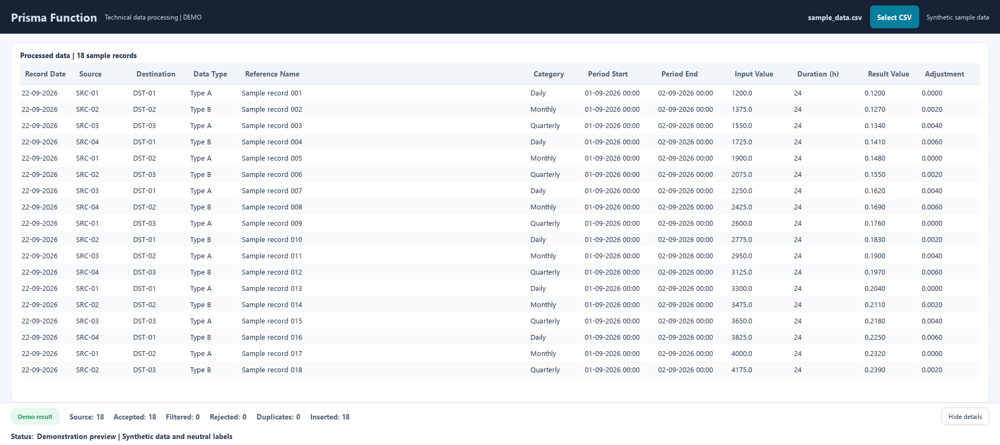

#👋 Hi, I'm Valerii Solod 

## 💻 Junior Fullstack Developer

## ⚙️ Fullstack Developer

Fullstack developer with experience in **JavaScript, React, Redux, Node.js, and MongoDB**.  
- Skilled in creating **single-page applications (SPA)**.  
- Experienced in **integrating REST API** and implementing **responsive/adaptive UI components**.  
- Knowledge of **Agile/Scrum methodologies**, **version control (Git)**, and **performance optimisation techniques**.  
- Strong **problem-solving skills** and a proactive approach to developing **scalable web solutions**.

 ## 💼 Tech Stack

 
  
## 🚀 Featured Projects

### 🖥️ Prisma Function

**Project type:** Commercial project.

**Prisma Function** — desktop software for automated technical data processing and analysis.
The project includes data import, structured calculations, result validation, report generation, and export of processed information. The application was designed with a focus on reliability, reproducible calculations, clear presentation of results, and convenient installation on Windows.
**Key areas:** data processing, analytical calculations, validation, reporting, desktop application development, automated workflows, and deployment.

---

### 📒 NoteHub Auth (2026)

**Description:** Note-management application with authentication, private routes, profile pages, search, pagination, tag filtering, note details, modal preview, and CRUD-related flows.  
**Tech stack:** Next.js, React, TypeScript, Zustand, TanStack Query, Axios, REST API, CSS Modules, Vercel  
**Role:** Developer — implemented route-based pages and reusable components, integrated API requests, worked with authentication state, cookies, protected navigation, modal routing, responsive UI, and deployment fixes.

---

### 🍰 Sweet Workshop / Team Project (2026)

**Description:** Responsive website for a pastry shop showcasing desserts, cakes, delivery information, FAQ, reviews, and customer interaction sections.  
**Tech stack:** HTML5, CSS3, JavaScript, Flexbox, responsive layout  
**Role:** Developer — developed the *Our Bestsellers* section and footer, worked with responsive layout, semantic HTML, reusable styling, visual consistency, and collaboration within a team workflow.

## 🌐 Languages

## 📫 How to reach me

